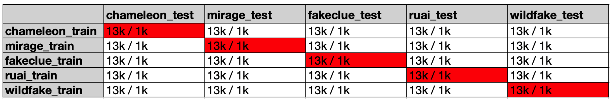
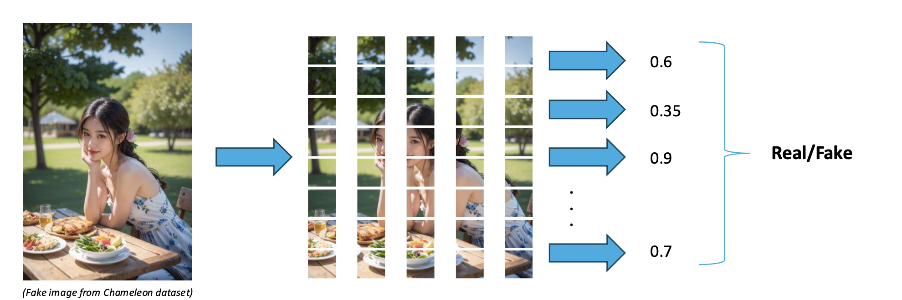

# AI-Generated Image Detection with ELD: Generalizing to Unseen Domains

This work was conducted in the summer term (April – August) 2025 as one of the approaches for my master's practical (Deep Learning Lab), supervised by the Computer Vision Group at RWTH Aachen University. For this practical, I achieved the grade 1.3/1.0 ([see certification here](certificate_grade.pdf)). The following is a short summary highlighting the key points of my approach (called ELD), the experimental setup, the evaluation metrics, and the results.

## Introduction
While advances in the field of generative AI, especially image and video generation, are very exciting and have their benefits, there is the risk of unethically using these technologies, such as for creating fake news, identity theft, or other scams. In this work, I attempt to contribute to the field of AI-generated image detection by developing models that can classify whether an input image is real or generated by AI models (fake), such as diffusion models or GANs.

Given the availability of modern deep learning frameworks such as PyTorch [1] and general feature extractors such as DINOv2 [2], training a binary classification model on some image dataset is not considered challenging and is relatively easy. Therefore, in this work, the focus is on developing models that can also generalize well on out-of-distribution data. Specifically, five different datasets, each containing fake and real images, are gathered that have distinct domains. The goal and challenge of this work is to develop a model that, trained on one dataset, can perform reasonably on all other four datasets.

## Datasets
### Chameleon [3]
This dataset contains real and fake images from four main domains: images of people, scenes (e.g., nature), animals, and objects. It is noteworthy to say that this dataset is highly unbalanced, meaning there is not an equal number of fake and real images in this dataset. Furthermore, there is not the same proportion of the mentioned domains in the dataset. For example, most of the fake images are of people, but most of the real images are images of scenes (i.e., photographs of landscapes and nature). In addition, real and fake images of the same domain also have different distributions, e.g., most of the fake images of people are AI-generated depictions of individuals with East Asian features (with a higher proportion being female). In contrast, most of the real images of people depict individuals of European descent. This makes learning a robust AI-image detector challenging, since the model can simply predict if an image is fake or not based on the content and the biases in the dataset. Nonetheless, this dataset is used because it has very realistic images of different models, which are also hard for a human to judge whether they are real or not.
### Miragenews [4]
This dataset contains mostly political images (e.g., images of political figures giving a speech in front of some people). It is noteworthy to say that this dataset is very well balanced in terms of the number and the content of the fake and real images. To be more specific, for each real image (which was sampled from the TARA [5] dataset), the authors generated a fake image with the same content.
### Fakeclue [6]
This dataset contains mostly images of close-ups of faces, magazine/newspaper articles, nature, and satellite images.
### RU-AI [7] & WildFake [8]
These two datasets have real and fake images from different domains (general images, not focused on a particular domain), but most of the fake images are not very realistic, and hence it is easier to tell if they are real or not (for a human). Nonetheless, I also used these datasets to get access to more data for this project.

## Experimental Setup & Metrics
From each above-mentioned dataset, 7,500 real and 7,500 fake images were sampled (only 15K images per dataset, because Miragenews does not have more images). From these samples, train(13K)/eval(1K)/test(1K) splits were created for each dataset. 

For evaluating each approach, the approach was first used to train models on the mentioned datasets independently, meaning 5 different models, each trained only on one dataset. Then, each trained model was evaluated independently on the eval/test sets of each dataset, and metrics such as accuracy and F1 were calculated. So, at the end, for one approach 5 models were trained and 25 accuracy scores were calculated, which are the accuracies of the models trained on the train set of dataset $X$ and tested on the eval/test set of dataset $Y$ (for $X$, $Y$ $\in${Chameleon, Miragenews, Fakeclue, RU-AI, WildFake}). For each approach, these accuracy scores can be stored in a matrix (similar to **Figure 1**).

*Figure 1: Accuracy Matrix*

From this matrix, two metrics were derived: the Average Diagonal Accuracy (ADA) and the Average Off-Diagonal Accuracy (AODA).
ADA is the average accuracy of the models that were trained on dataset $X$ and also evaluated on dataset $X$. AODA is the average accuracy of models that were trained on dataset $X$ but evaluated on dataset $Z$, where $X \neq Z$. In other words, it is the average of the accuracies excluding the diagonal of the matrix. This is the main metric of this work, which is used to measure the generalizability of different approaches.

## Baseline Approach
The baseline approach consists of passing an image through a binary classifier that outputs a value between 0 (real) and 1 (fake), as the predicted label for this input image. The model used for the baseline consists of a DINOv2S model with frozen weights as a general feature extractor (backbone) and two additional fully connected layers as a classification head. Furthermore, the LeakyRELU function is used as a nonlinearity for the first added layer, and the Sigmoid function is used for the second (last) layer to transform the value to the range $[0, 1]$. The binary cross entropy error is used as a loss function during the training.

## Ensemble of Local Detectors (ELD)
The core idea behind the ELD approach is to extract small patches from an input image, analyze each one independently to assess whether it likely comes from a real or fake image, and then use majority voting across all individual analyses to determine if the overall image is real or fake.
### ELD Training Mode
Training mode refers to how a model is trained in this approach. Given a batch of images, for each image the following steps are done in the following order:
1. If the area of the image is larger than $\texttt{target\_area}$, it is resized to have an area equal to $\texttt{target\_area}$ while preserving the height and width proportions of the original image. This step is called *resolution unification*, and $\texttt{target\_area}$ is a hyperparameter that should be set based on the image area statistics of the training dataset. This step is done to counter resolution imbalance in the datasets.
2. $n$ random patches of size $p \times p$ are extracted from the image. $n$ and $p$ are additional hyperparameters. Furthermore, $p$ should be equal to or smaller than the $min(width,height)$ of the smallest image in the dataset.
3. Each extracted patch is upscaled (resized) to $u \times u$, where $u$ is another hyperparameter and $p<u$.
Doing the above-mentioned steps results in $n$ images of size $u \times u$ per input image. Now, these images (upscaled patches) are used as if they are independent images in a dataset. E.g., if the dataloader outputs 10 images and $n=50$, a mini-batch of 500 upscaled random patches (which are images of size $u \times u$) is used for the forward/backward propagations. Note that at each epoch, different patches are extracted from the same image due to randomness.
### ELD Evaluation Mode
Evaluation mode refers to using a trained model to classify whether a new input (test) image is fake or real. Similar to training mode, first resolution unification is applied, then the resulting image is divided into patches, as depicted in **Figure 2**. After upscaling each patch, similar to step 3 in the training mode, each patch (which is an image of size $u \times u$) is passed through the model and receives an output from the model. Because the same network architecture is used as in the baseline, these outputs are numbers between zero and one. Finally, the average of these outputs is used as the final score for the original test image, and if it’s equal to or above 0.5, the image is classified as fake, and otherwise as real.

*Figure 2: ELD Evaluation Mode*

### Default ELD Configurations
After analyzing the area distributions of fake and real images in the used datasets, the $\texttt{target\_area}$ is set to 150K pixels for the Chameleon, Miragenews, and RU-AI datasets, and to 40K pixels for the Fakeclue and WildFake datasets. In addition, the hyperparameter $n$ is set to 50, $p$ to 56, and $u$ to 224. These represent the default configurations for ELD in this work, meaning that unless otherwise stated, these values are assumed to be used.

## Results
In order to make the results of the two approaches (baseline and ELD) comparable, the same training configurations and model architectures are used. The default model architecture is the one mentioned in the baseline section: DINOv2S with frozen weights as backbone and two additional (trainable) FC layers as a classification head. The default training configurations are the following:
- Batch size: 256
- Learning rate: 1e-4
- Optimizer: AdamW
- Epochs: 10
- Learning rate scheduler: Cosine annealing
- Loss function: BCELoss

Given the above-mentioned training configuration, the baseline achieved an AODA score of 58.6%, while the ELD approach achieved an AODA score of 65.8%. Subsequently, some hyperparameter optimization was performed independently for each approach. With these new configurations (and model architectures), the baseline approach achieved an AODA score of 63.4%, and the ELD approach achieved an AODA score of 69.7%. The following table summarizes these results:

| Approach    | ADA Score   | AODA Score    |
| :---        |    :----:   |          ---: |
| Baseline (default configuration)   | 82,3% | 58,6% |
| Baseline (after HPO)   | 87,6% | 63,4% |
| ELD (default configuration)   | 88,6% | 65,8% |
| ELD (after HPO)   | 93,8% | 69,7% |

It is also noteworthy that if we use ELD with the configuration optimized for the baseline, we still obtain an AODA score of 66.8%, which is higher than the baseline score of 63.4%. This indicates that, although the training configurations were optimized for the baseline approach, using the same configurations with ELD still leads to a significant improvement in AODA.

In conclusion, the ELD approach outperformed the baseline by 11.1% in terms of the AODA score.

## References
[1] - Adam Paszke, Sam Gross, Francisco Massa, Adam Lerer,
James Bradbury, Gregory Chanan, Trevor Killeen, Zeming
Lin, Natalia Gimelshein, Luca Antiga, Alban Desmaison,
Andreas Köpf, Edward Yang, Zach DeVito, Martin Raison,
Alykhan Tejani, Sasank Chilamkurthy, Benoit Steiner, Lu
Fang, Junjie Bai, and Soumith Chintala. Pytorch: An imperative style, high-performance deep learning library, 2019.

[2] - Maxime Oquab, Timothee Darcet, Theo Moutakanni, Huy
Vo, Marc Szafraniec, Vasil Khalidov, Pierre Fernandez,
Daniel Haziza, Francisco Massa, Alaaeldin El-Nouby, Mahmoud Assran, Nicolas Ballas, Wojciech Galuba, Russell
Howes, Po-Yao Huang, Shang-Wen Li, Ishan Misra, Michael
Rabbat, Vasu Sharma, Gabriel Synnaeve, Hu Xu, Herve Jegou, Julien Mairal, Patrick Labatut, Armand Joulin, and Piotr
Bojanowski. Dinov2: Learning robust visual features without supervision, 2024.

[3] - Shilin Yan, Ouxiang Li, Jiayin Cai, Yanbin Hao, Xiaolong Jiang, Yao Hu, and Weidi Xie. A sanity check for ai-generated image detection, 2025.

[4] - Runsheng Huang, Liam Dugan, Yue Yang, and Chris Callison-Burch. Miragenews: Multimodal realistic ai-generated news detection,  2024.

[5] - Xingyu Fu, Ben Zhou, Ishaan Chandratreya, Carl Von drick, and Dan Roth. 2022. There’s a time and place for reasoning beyond the image. In Proceedings of the 60th Annual Meeting of the Association for Computational Linguistics (Volume 1: Long Papers), pages 1138–1149, Dublin, Ireland. Association for Computational Linguistics.

[6] - Siwei Wen, Junyan Ye, Peilin Feng, Hengrui Kang, Zichen Wen, Yize Chen, Jiang Wu, Wenjun Wu, Conghui He, and Weijia Li. Spot the fake: Large multimodal model-based synthetic image detection with artifact explanation, 2025.

[7] - Liting Huang, Zhihao Zhang, Yiran Zhang, Xiyue Zhou, and Shoujin Wang. Ru-ai: A large multimodal dataset for machine-generated content detection. In Companion Proceedings of the ACM on Web Conference 2025, page 733–736, New York, NY, USA, 2025. Association for Computing Machinery.

[8] - Yan Hong and Jianfu Zhang. Wildfake: A large-scale challenging dataset for ai-generated images detection, 2024.